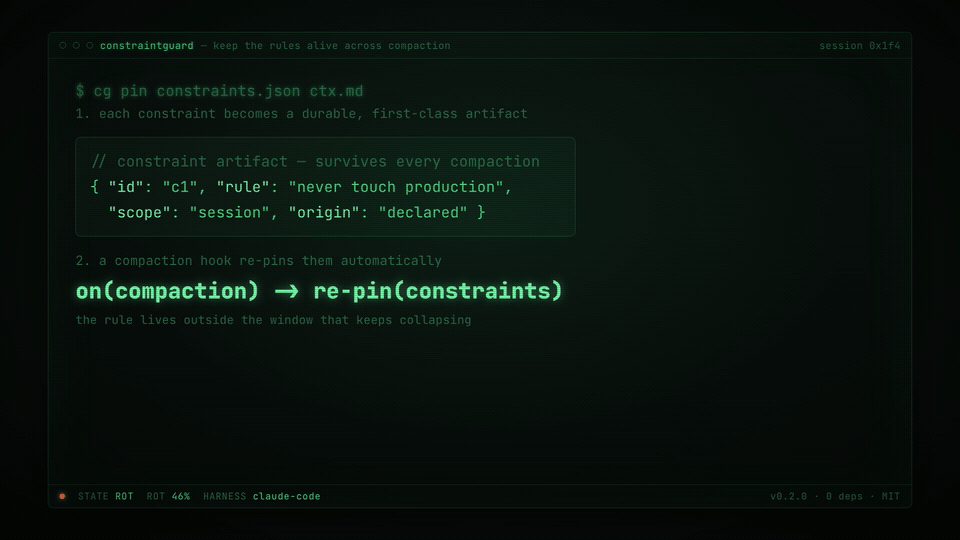

# ConstraintGuard

[](https://github.com/abhid1234/constraintguard/actions/workflows/ci.yml) [](LICENSE) 

**[▶ Try the live playground →](https://constraintguard.vercel.app)** · demos run the real library in your browser.




**Keep an AI agent's declared constraints alive across context compaction.** Zero dependencies.

When a long-running agent summarizes its history to fit the context window, its safety and policy constraints get silently dropped — measured violation rates jump from 0% to as high as 59% ([arXiv:2606.22528](https://arxiv.org/abs/2606.22528), *Governance Decay*; "ConstraintRot" is its benchmark). ConstraintGuard extracts declared constraints *before* compaction and re-pins them *after*, and ships a conformance suite so you can measure the risk on any harness.

## Install

```bash
npm i -g @avee1234/constraintguard   # or: npx @avee1234/constraintguard
```

## Commands

```bash
cg validate constraints.json   # is this a well-formed constraint set?
cg extract session.md          # pull declared constraints out of a context
cg extract --harness claude-code session.jsonl  # …or straight from a Claude Code transcript
cg extract --harness codex rollout.jsonl        # …or from an OpenAI Codex CLI rollout
cg extract --harness antigravity AGENTS.md      # …or a Google Antigravity rules file
cg pin constraints.json ctx.md # re-inject constraints into a (compacted) context
cg conformance orig.md new.md  # score how well constraints survive compaction
cg budget reads.json --max-tokens 8000  # audit what was loaded vs. what was needed
cg otel constraints ctx.md     # map constraints to OpenTelemetry span attributes
```

The `otel` command emits a flat attribute object under the stable `constraintguard.*`
namespace (no OpenTelemetry SDK) — attach it to any span so "which constraints were
declared / dropped" shows up in your agent's trace.

## Context budget — keep the context lean

ConstraintGuard owns **context integrity**, and integrity has two halves: keep the
*rules* alive across compaction (above), and keep the *context* itself lean. An
agent that loads a whole repo into context to answer one question is burning tokens
on ballast — the "99% fewer tokens" waste everyone is chasing. `cg budget` audits
it: given a **read-log** of what the agent loaded, it reports what was actually used
vs. dropped-in-and-never-touched, and whether any budget cap was blown.

Two plain, open JSON shapes mirror the constraint set — no service, no tokenizer:

```jsonc
// budget (all caps optional)
{ "max_tokens": 8000, "max_files": 20, "max_tokens_per_file": 2000 }

// read-log — one entry per thing the agent loaded.
// `tokens` is the caller's own count; `used` marks whether it was actually needed.
[
  { "path": "src/auth.js",  "tokens": 400, "used": true  },
  { "path": "vendor/big.js", "tokens": 6000, "used": false },
  { "path": "README.md",     "tokens": 200 }
]
```

```bash
cg budget reads.json --max-tokens 8000 --max-files 20   # human report; exit 2 if over budget
cg budget reads.json --json                             # machine-readable report
cat reads.json | cg budget -                            # read-log from stdin
cg otel budget reads.json --max-tokens 8000             # …as OpenTelemetry span attributes
```

`budgetReport(reads, budget?)` returns `{ total_tokens, file_count, over_budget,
overages, unused, unused_tokens, utilization, waste_ratio }`. The heart of it is
`unused` / `waste_ratio` — the loaded-but-never-used context you can cut — and
`overages`, one entry per blown cap so `cg budget` can gate CI (it exits `2` when
over budget, just like `cg conformance --threshold`). ConstraintGuard does not
tokenize: token counts come from the caller (a real model count is best; the
documented `estimateTokens(text)` ≈ chars/4 heuristic is a fallback, not a
tokenizer). A read is only ever counted as waste when it is explicitly
`used: false`, so the audit never over-accuses.

## Dogfood: auto-pin across Claude Code compaction

ConstraintGuard exists for one failure — an agent's declared rules silently
vanish when a long session compacts its context. The `cg hook` commands close
that loop **automatically inside Claude Code**: on compaction they extract the
session's declared constraints; immediately after, they re-inject them into the
freshly compacted context. No glue script, no file to maintain — just two hooks.

Drop this into `~/.claude/settings.json` (all projects) or `.claude/settings.json`
(one project) — it is [`hooks/claude-code/settings.json`](hooks/claude-code/settings.json)
verbatim:

```json
{
  "hooks": {
    "PreCompact": [
      { "hooks": [ { "type": "command", "command": "cg hook pre-compact" } ] }
    ],
    "SessionStart": [
      {
        "matcher": "compact",
        "hooks": [ { "type": "command", "command": "cg hook session-start" } ]
      }
    ]
  }
}
```

- **`cg hook pre-compact`** (event `PreCompact`, no matcher) reads the hook JSON
  on stdin, extracts the session's declared constraints from its transcript, and
  caches them keyed by `session_id`. Repeated compactions **union** into the
  cache, so a constraint declared early survives every later compaction.
- **`cg hook session-start`** (event `SessionStart`, matcher `compact`) reads the
  cached set and returns it as `hookSpecificOutput.additionalContext` — a single
  `cg pin`-rendered ```` ```constraints ```` block — which Claude Code appends to
  the compacted context. It prints nothing when the session declared no
  constraints.

Both hooks are fail-safe: any error (unreadable transcript, malformed JSON,
missing cache) exits `0` with no output, so a hook can never block compaction or
a session start. The cache lives under the OS temp dir — nothing is written to
your repo.

If `cg` is not on `PATH` in the hook environment, use
`npx --no-install constraintguard hook …` or an absolute path in place of `cg`.

**Verify it:** declare a constraint in a `constraints` fence, force a compaction
with `/compact`, and confirm the block reappears in the next turn.

> Note: `SessionStart`'s `source` string after compaction (and whether it fires
> after *automatic* window-full compaction, not just `/compact`) depends on your
> Claude Code version. If re-injection doesn't fire, adjust the `matcher` — no
> code change is needed.

Open format, dependency-free, cross-harness. Run the tests: `npm test`.

Reproduce the ConstraintRot drop on committed sample sessions: `npm run bench`. It
scores each session's original context against its compacted version with
`cg conformance` and prints a retention table plus the aggregate drop.

> Built by the Foundry software factory. Issues here are triaged, specced, implemented, reviewed and shipped by agents, with human approval at the gates.
